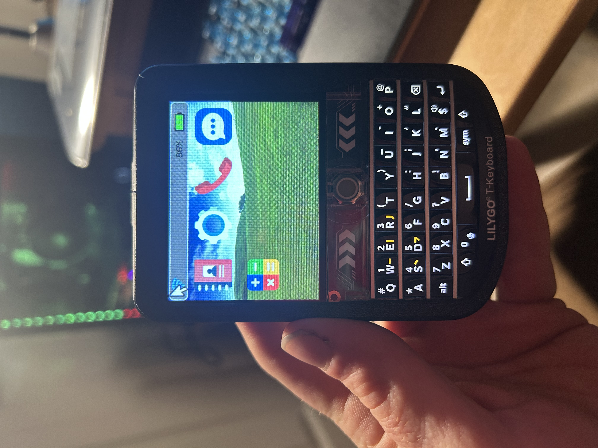

# T-Deck-DEV

### Device Specifications for LillyGo T-Deck with `LoRa`

| Name                                                                           | Value                                |
| ------------------------------------------------------------------------------ | ------------------------------------ |
| MCU                                                                            | ESP32-S3FN16R8                       |
| Wireless Connectivity                                                          | 2.4 GHz Wi-Fi & Bluetooth 5 (LE)     |
| Development                                                                    | Arduino, PlatformIO-IDE, Micropython |
| Flash                                                                          | 16MB                                 |
| PSRAM                                                                          | 8MB                                  |
| Battery ADC PIN                                                                | IO04                                 |
| Onboard functions                                                              | Trackball, Microphone, Speaker       |
| 2.8 inch ST7789 SPI Interface IPS LCD: Resolution 320 x 240 Full viewing angle |
| SX1262 LoRa Transceiver (Chip Optional)                                        |
| Transmit power                                                                 | +22dBm                               |
| Frequency Optional                                                             | 433/868/`915Mhz`                     |

### Pin Diagram

| Pin Name      | Pin Number | Pin Name        | Pin Number |
| ------------- | ---------- | --------------- | ---------- |
| Power On      | `10`       | Radio CS        | `9`        |
| SPI MOSI      | `41`       | Trackball Up    | `3`        |
| SPI MISO      | `38`       | Trackball Down  | `15`       |
| SPI CLK       | `40`       | Trackball Left  | `1`        |
| Sdcard        | `39`       | Trackball Right | `2`        |
| Tft CS        | `12`       | Trackball Click | `0`        |
| Tft DC        | `11`       | Es7210 MCLK     | `48`       |
| Tft BL        | `42`       | Es7210 LRCK     | `21`       |
| Radio CS      | `9`        | Es7210 SCK      | `47`       |
| Radio BUSY    | `13`       | Es7210 DIN      | `14`       |
| Radio RST     | `17`       | I2S WS          | `5`        |
| Radio DI01    | `45`       | I2S BCK         | `7`        |
| I2C SDA       | `18`       | I2S DOUT        | `6`        |
| I2C SCL       | `8`        | Battery ADC     | `4`        |
| Touch init    | `16`       | Keyboard Addr   | `0x55`     |
| Keyboard init | `46`       |

|

